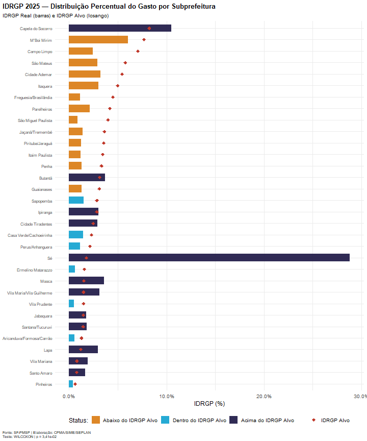
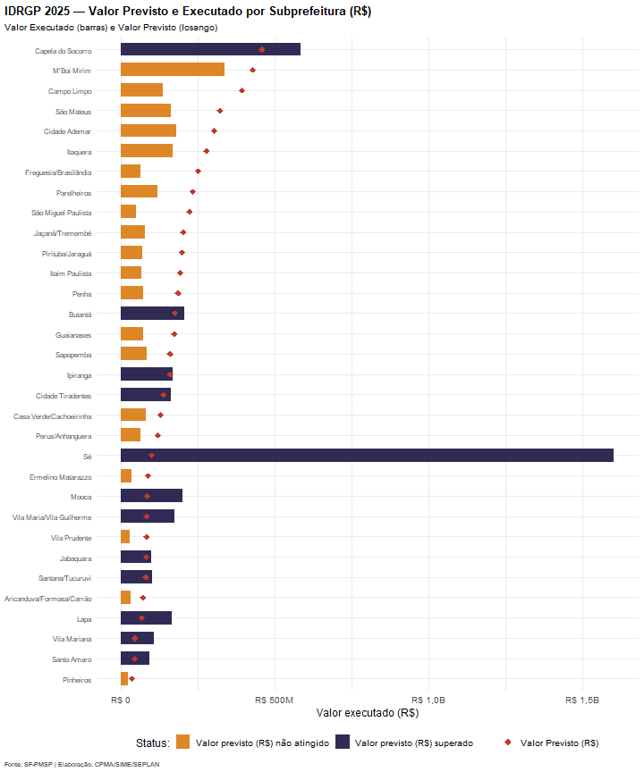
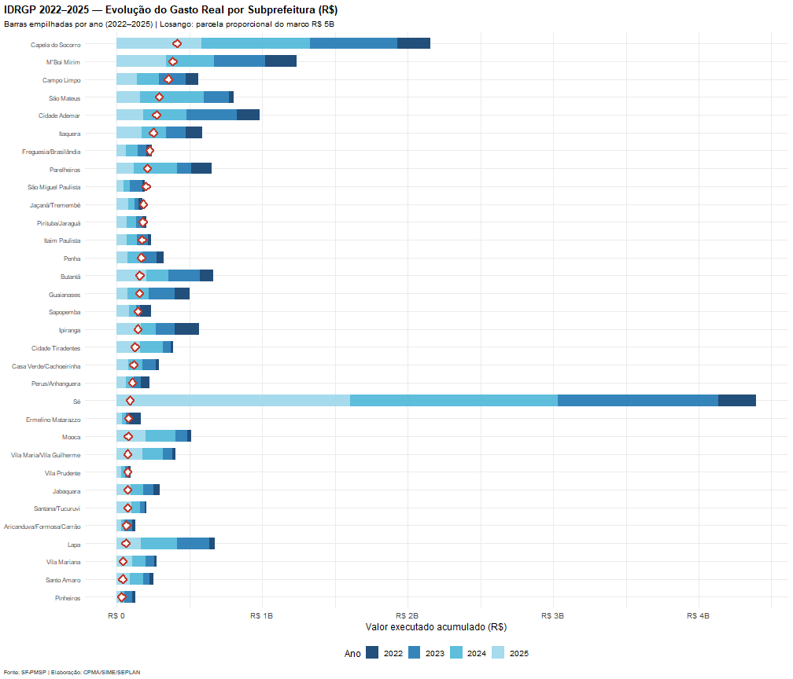
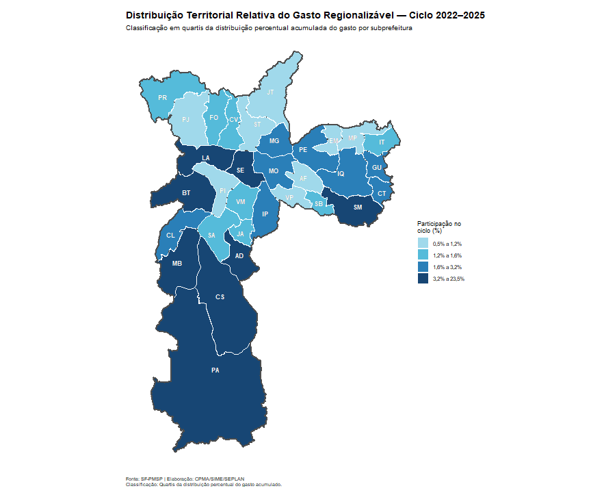
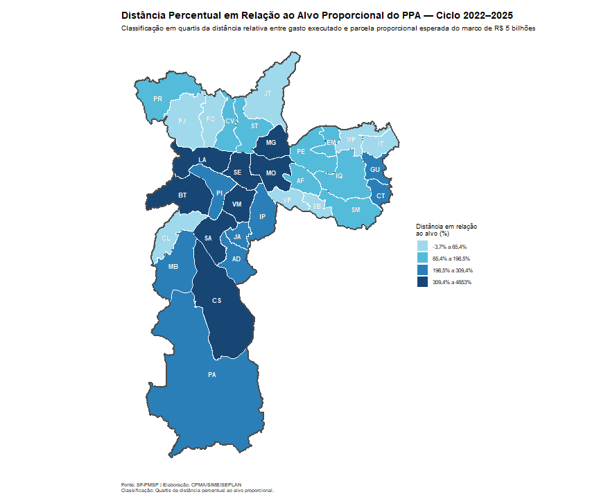

# Introdução e Metodologia

Este documento apresenta a análise da Execução Orçamentária Regionalizável para o ciclo PPA 2022-2025.


``` r
# ============================================================================
# CHUNK 2: CARGA DA BASE PRINCIPAL + VALIDAÇÃO TERRITORIAL E TEMPORAL
# ============================================================================

caminho_tabela <- file.path(
  "C:/Users/d954257/OneDrive - rede.sp/Área de Trabalho/IDRGP/IDRGP-2025/R Markdown",
  "dados/base_resumida_ppa_idrgp.xlsx"
)

pasta_dados <- file.path(
  "C:/Users/d954257/OneDrive - rede.sp/Área de Trabalho/IDRGP/IDRGP-2025/R Markdown",
  "dados"
)

if (!file.exists(caminho_tabela)) {
  stop("❌ Base principal não encontrada: ", caminho_tabela)
}

dados_brutos_raw <- read_excel(caminho_tabela) |> clean_names()

colunas_obrigatorias <- c(
  "chave", "ano_empenho", "codigo_proj_ativ",
  "descricao_proj_ativ", "subprefeitura", "valor"
)
faltando_base <- setdiff(colunas_obrigatorias, names(dados_brutos_raw))

if (length(faltando_base) > 0) {
  stop(
    "❌ A nova base não possui as colunas obrigatórias: ",
    paste(faltando_base, collapse = ", ")
  )
}

# Validação explícita antes de qualquer group_by(), summarise(), left_join()
# ou construção cartográfica: só seguem adiante registros de subprefeituras
# oficiais e com ANO_EMPENHO válido.
dados_brutos_pre <- dados_brutos_raw |>
  transmute(
    chave = as.character(chave),
    ano_empenho = suppressWarnings(as.integer(ano_empenho)),
    ano_liquidacao = suppressWarnings(as.integer(ano_liquidacao)),
    codigo_proj_ativ = as.character(codigo_proj_ativ) |> str_trim(),
    descricao_proj_ativ = as.character(descricao_proj_ativ) |> str_squish(),
    subprefeitura_original = as.character(subprefeitura) |> str_squish(),
    valor = suppressWarnings(as.numeric(valor)),
    join_key = norm_name(subprefeitura)
  )

if (any(is.na(dados_brutos_pre$ano_empenho))) {
  stop("❌ Há registros sem ANO_EMPENHO válido na base principal.")
}

anos_esperados <- 2022:2025
anos_encontrados <- sort(unique(dados_brutos_pre$ano_empenho))
if (!setequal(anos_encontrados, anos_esperados)) {
  warning(
    "⚠️ ANO_EMPENHO fora do intervalo esperado. Encontrados: ",
    paste(anos_encontrados, collapse = ", ")
  )
}

auditoria_territorial <- dados_brutos_pre |>
  count(subprefeitura_original, join_key, name = "n_registros") |>
  left_join(
    tabela_siglas |> select(join_key, subprefeitura_oficial = subprefeitura, sigla),
    by = "join_key"
  )

registros_invalidos <- auditoria_territorial |>
  filter(is.na(subprefeitura_oficial))

duplicidades_exatas <- dados_brutos_pre |>
  count(
    chave, ano_empenho, codigo_proj_ativ, descricao_proj_ativ,
    subprefeitura_original, valor, name = "n_duplicatas"
  ) |>
  filter(n_duplicatas > 1)

dados_brutos <- dados_brutos_pre |>
  inner_join(
    tabela_siglas |> select(join_key, subprefeitura, sigla),
    by = "join_key"
  ) |>
  select(
    chave, ano_empenho, ano_liquidacao, codigo_proj_ativ,
    descricao_proj_ativ, subprefeitura, sigla, valor, join_key
  )

subprefeituras_ordem <- sort(unique(dados_brutos$subprefeitura))

resumo_base_principal <- dados_brutos |>
  group_by(ano_empenho) |>
  summarise(
    registros = n(),
    subprefeituras = n_distinct(subprefeitura),
    acoes = n_distinct(codigo_proj_ativ),
    valor_total = sum(valor, na.rm = TRUE),
    .groups = "drop"
  )

write_xlsx(
  list(
    resumo_base_principal = resumo_base_principal,
    auditoria_territorial = auditoria_territorial,
    duplicidades_exatas = duplicidades_exatas
  ),
  file.path(pasta_saida, "tabelas", "auditoria_base_principal.xlsx")
)

cat("✅ Base principal carregada:", nrow(dados_brutos), "registros válidos\n")
```

```
## ✅ Base principal carregada: 24462 registros válidos
```

``` r
cat("✅ ANO_EMPENHO validado:", paste(anos_encontrados, collapse = ", "), "\n")
```

```
## ✅ ANO_EMPENHO validado: 2022, 2023, 2024, 2025
```

``` r
cat("✅ Subprefeituras válidas:", n_distinct(dados_brutos$subprefeitura), "\n")
```

```
## ✅ Subprefeituras válidas: 32
```

``` r
cat("✅ Registros territoriais inválidos removidos:", nrow(registros_invalidos), "\n")
```

```
## ✅ Registros territoriais inválidos removidos: 0
```

``` r
cat("✅ Duplicidades exatas auditadas:", nrow(duplicidades_exatas), "\n")
```

```
## ✅ Duplicidades exatas auditadas: 47
```

``` r
# CARGA DO SHAPEFILE
caminho_shape <- file.path(pasta_dados, "SIRGAS_SHP_subprefeitura.shp")

if (!file.exists(caminho_shape)) {
  arquivos_shp <- list.files(pasta_dados, pattern = "subprefeitura.*\\.shp$", ignore.case = TRUE, full.names = TRUE)
  
  if (length(arquivos_shp) == 0) {
    arquivos_shp <- list.files(pasta_dados, pattern = "\\.shp$", full.names = TRUE)
  }
  
  if (length(arquivos_shp) > 0) {
    caminho_shape <- arquivos_shp[1]
    cat("📂 Shapefile alternativo encontrado:", basename(caminho_shape), "\n")
  } else {
    stop("❌ NENHUM shapefile (.shp) encontrado na pasta: ", pasta_dados)
  }
}
```

```
## 📂 Shapefile alternativo encontrado: subprefeitura_v2.shp
```

``` r
sf_sp <- st_read(caminho_shape, quiet = TRUE) |> clean_names()
cat("✅ Shapefile carregado:", nrow(sf_sp), "feições\n")
```

```
## ✅ Shapefile carregado: 32 feições
```

``` r
# Identificar e renomear coluna de nome do shapefile
padroes_nome <- c("sp_nome", "nm_subpref", "subprefei", "nome", "sub", "NOME", "SUBPREFEI")
col_nome <- intersect(padroes_nome, names(sf_sp))[1]
if (is.na(col_nome)) {
  col_nome <- names(sf_sp)[sapply(sf_sp, is.character)][1]
}
sf_sp <- sf_sp |> rename(sp_nome = all_of(col_nome))

cat("📋 Colunas:", paste(names(sf_sp), collapse = ", "), "\n")
```

```
## 📋 Colunas: cd_identif, cd_subpref, sp_nome, tx_escala, sg_fonte_o, dt_criacao, cd_tipo_di, dt_atualiz, cd_usuario, sg_subpref, qt_area_qu, qt_area_me, geometry
```

``` r
# ============================================================================
# FILTRAGEM PELA CESTA DE AÇÕES SELECIONADAS
# ============================================================================

# Carregar tabela oficial da cesta
tabela_cesta <- read_excel(
  file.path(pasta_dados, "Despesas_IDRGP_2024.xlsx")
) |>
  clean_names() |>
  mutate(codigo_proj_ativ = as.character(codigo_proj_ativ) |> str_trim())

cat("📋 Cesta oficial carregada:", nrow(tabela_cesta), "ações\n")
```

```
## 📋 Cesta oficial carregada: 87 ações
```

``` r
# Aplicar filtro da cesta
dados_cesta <- dados_brutos |>
  filter(codigo_proj_ativ %in% tabela_cesta$codigo_proj_ativ)

# Auditoria imediata
cat("========================================\n")
```

```
## ========================================
```

``` r
cat("🔍 AUDITORIA DA FILTRAGEM\n")
```

```
## 🔍 AUDITORIA DA FILTRAGEM
```

``` r
cat("========================================\n")
```

```
## ========================================
```

``` r
cat("Ações nos dados brutos:       ", n_distinct(dados_brutos$codigo_proj_ativ), "\n")
```

```
## Ações nos dados brutos:        348
```

``` r
cat("Ações na cesta oficial:       ", n_distinct(tabela_cesta$codigo_proj_ativ), "\n")
```

```
## Ações na cesta oficial:        87
```

``` r
cat("Ações após filtro (dados_cesta):", n_distinct(dados_cesta$codigo_proj_ativ), "\n")
```

```
## Ações após filtro (dados_cesta): 60
```

``` r
# Verificar se há ações na cesta que NÃO estão nos dados
faltantes <- anti_join(
  tabela_cesta |> select(codigo_proj_ativ),
  dados_cesta |> select(codigo_proj_ativ) |> distinct(),
  by = "codigo_proj_ativ"
)

if (nrow(faltantes) > 0) {
  cat("⚠️ Ações da cesta SEM dados na base:\n")
  print(faltantes)
} else {
  cat("✅ Todas as ações da cesta têm dados na base\n")
}
```

```
## ⚠️ Ações da cesta SEM dados na base:
## # A tibble: 27 × 1
##    codigo_proj_ativ
##    <chr>           
##  1 6245            
##  2 6249            
##  3 6151            
##  4 6163            
##  5 2411            
##  6 9003            
##  7 5474            
##  8 3399            
##  9 5602            
## 10 4432            
## # ℹ 17 more rows
```

``` r
# Verificar se NÃO há ações externas nos dados_cesta
sobrando <- anti_join(
  dados_cesta |> select(codigo_proj_ativ) |> distinct(),
  tabela_cesta |> select(codigo_proj_ativ),
  by = "codigo_proj_ativ"
)

if (nrow(sobrando) > 0) {
  cat("❌ ERRO: Ações externas à cesta encontradas em dados_cesta:\n")
  print(sobrando)
  stop("Filtragem incorreta. Verifique o join.")
} else {
  cat("✅ Nenhuma ação externa à cesta em dados_cesta\n")
}
```

```
## ✅ Nenhuma ação externa à cesta em dados_cesta
```

``` r
cat("========================================\n")
```

```
## ========================================
```

``` r
# TABELA DE EXPORTAÇÃO DA AUDITORIA
auditoria_export <- tibble(
  item = c(
    "Registros válidos na base principal",
    "Subprefeituras oficiais validadas",
    "Registros territoriais inválidos removidos",
    "Duplicidades exatas auditadas",
    "Ações na cesta oficial",
    "Ações após filtro",
    "Ações faltantes na base",
    "Ações externas ao filtro"
  ),
  valor = c(
    nrow(dados_brutos),
    n_distinct(dados_brutos$subprefeitura),
    nrow(registros_invalidos),
    nrow(duplicidades_exatas),
    n_distinct(tabela_cesta$codigo_proj_ativ),
    n_distinct(dados_cesta$codigo_proj_ativ),
    nrow(faltantes),
    nrow(sobrando)
  )
)

write_xlsx(auditoria_export, file.path(pasta_saida, "tabelas", "auditoria_filtragem.xlsx"))
cat("✅ Tabela de auditoria exportada\n")
```

```
## ✅ Tabela de auditoria exportada
```


``` r
# ============================================================================
# CHUNK 3: PREPARAÇÃO DOS DADOS PARA TESTES ESTATÍSTICOS
# ============================================================================

# Identificar coluna de valor disponível
col_valor <- intersect(
  c("valor_detalhamento_acao", "valor_empenhado", "valor_liquidado", "valor"),
  names(dados_cesta)
)[1]

if (is.na(col_valor)) {
  # Fallback: usar a primeira coluna numérica que contenha "valor"
  col_valor <- names(dados_cesta)[str_detect(names(dados_cesta), "valor") & 
    sapply(dados_cesta, is.numeric)][1]
}

cat("📊 Coluna de valor utilizada:", col_valor, "\n")
```

```
## 📊 Coluna de valor utilizada: valor
```

``` r
dados_testes <- dados_cesta |>
  rename(valor_calc = all_of(col_valor)) |>
  group_by(subprefeitura, ano_empenho) |>
  summarise(
    valor_total = sum(valor_calc, na.rm = TRUE),
    .groups = "drop"
  ) |>
  group_by(ano_empenho) |>
  mutate(
    percentual_liquidado = valor_total / sum(valor_total, na.rm=TRUE) * 100,
    percentual_referencia = 100 / length(subprefeituras_oficiais)
  ) |>
  ungroup()

# Aplicar nos dados
dados_testes <- dados_testes |>
  mutate(subprefeitura_pad = padronizar_nome(subprefeitura))

# Aplicar no shapefile
sf_sp <- sf_sp |>
  mutate(sp_nome_pad = padronizar_nome(sp_nome))

# Verificar correspondência
nomes_dados <- unique(dados_testes$subprefeitura_pad)
nomes_shape <- unique(sf_sp$sp_nome_pad)

cat("📊 Subprefeituras nos dados:", length(nomes_dados), "\n")
```

```
## 📊 Subprefeituras nos dados: 32
```

``` r
cat("📊 Subprefeituras no shapefile:", length(nomes_shape), "\n")
```

```
## 📊 Subprefeituras no shapefile: 32
```

``` r
# Verificar quais NÃO têm correspondência
sem_match <- setdiff(nomes_dados, nomes_shape)
if (length(sem_match) > 0) {
  warning("⚠️ Subprefeituras sem correspondência no shapefile:")
  print(sem_match)
}
```


```
## ✅ IVU carregado: 32 subprefeituras
```


``` r
# ============================================================================
# CHUNK 5: APLICAÇÃO DOS TESTES ESTATÍSTICOS
# Nota: agora posterior à carga do IVU para que subprefeituras estejam
#       ranqueadas antes da aplicação dos testes.
# ============================================================================

resultados_testes <- list()

for (ano_atual in sort(unique(dados_testes$ano_empenho))) {
  dados_ano <- dados_testes |> filter(ano_empenho == ano_atual)
  if (nrow(dados_ano) == 0) next
  
  teste <- NULL
  if (ano_atual %in% c(2022, 2023)) {
    teste <- tryCatch(t.test(dados_ano$percentual_referencia, dados_ano$percentual_liquidado, paired = TRUE), error = function(e) NULL)
  } else if (ano_atual == 2024) {
    teste <- tryCatch(wilcox.test(dados_ano$percentual_referencia, dados_ano$percentual_liquidado, paired = TRUE), error = function(e) NULL)
  } else if (ano_atual == 2025) {
    teste <- tryCatch(ks.test(dados_ano$percentual_referencia, dados_ano$percentual_liquidado), error = function(e) NULL)
  }
  
  if (!is.null(teste) && "p.value" %in% names(teste)) {
    dados_ano <- dados_ano |>
      mutate(
        p_valor = teste$p.value,
        categoria = case_when(
          p_valor < 0.05 & percentual_liquidado < percentual_referencia ~ "Abaixo do IDRGP Alvo",
          p_valor < 0.05 & percentual_liquidado > percentual_referencia ~ "Acima do IDRGP Alvo",
          TRUE ~ "Dentro do IDRGP Alvo"
        )
      )
  } else {
    dados_ano <- dados_ano |> mutate(p_valor = NA, categoria = "Dentro do IDRGP Alvo")
  }
  resultados_testes[[as.character(ano_atual)]] <- dados_ano
}

dados_classificados <- bind_rows(resultados_testes) |>
  mutate(subprefeitura = factor(subprefeitura, levels = subprefeituras_ordem))
```


```
## ✅ Consolidação histórica concluída
```

```
## 📊 df_integrado: 32 linhas
```

```
## 📊 df_ciclo: 32 linhas
```

```
## 📊 df_ciclo_sf: 32 feições
```

```
## 📊 df_longo: 128 linhas
```

```
## 
## ========================================
```

```
## 📊 15. RESUMO DA REGIONALIZAÇÃO
```

```
## ========================================
```

```
## 🎯 Marco do PPA:            R$ 5.000.000.000
```

```
## 💰 Total gasto no ciclo:    R$ 18.718.800.858
```

```
## 📏 Distância para a meta:   R$ 13.718.800.858 (superou)
```

```
## 📊 % alcançado da meta:      374,4 %
```

```
##    Abaixo do IDRGP Alvo : 10 subprefeituras
##    Acima do IDRGP Alvo : 11 subprefeituras
##    Dentro do IDRGP Alvo : 11 subprefeituras
```

```
## 
## 📐 Amplitude da diferença IDRGP: 25,76 p.p.
```

```
## ========================================
```


```
## 
## ========================================
```

```
## 🔒 AUDITORIA PRÉ-MAPAS
```

```
## ========================================
```

```
## ✅ dados_testes — existe
## ✅ dados_classificados — existe
## ✅ df_integrado — existe
## ✅ df_ciclo — existe
## ✅ df_longo — existe
## ✅ df_ciclo_sf — existe
```

```
## ✅ Nenhuma ação externa à cesta nos dados classificados
```

```
## 
## 📢 CONFIRMAÇÃO: Todos os mapas, gráficos e análises estão sendo
```

```
##    gerados EXCLUSIVAMENTE com ações da cesta selecionada.
```

```
##    Arquivo de referência: Despesas_IDRGP_2024.xlsx
```

```
## ========================================
```

# Gráficos


```
## ✅ Configuração de mapas carregada
```


```
## ✅ Dados preparados para gráficos (modelo IDRGP_2025)
```

```
## 📊 Subprefeituras: 32
```

```
## 💰 Valor total 2025: R$ 5.565.834.726
```

```
## 💰 Valor total ciclo: R$ 18.718.800.858
```

```
## 🎯 Marco PPA (R$ 5 bilhões): R$ 5.000.000.000
```

## Produto 1 — IDRGP 2025: Alvo vs. Real (%)


```
## ✅ Produto 1 gerado — IDRGP 2025: Alvo vs Real (%)
```

## Produto 2 — IDRGP 2025: Valores Absolutos (R$)


```
## ✅ Produto 2 gerado — IDRGP 2025: Valores Absolutos (R$)
```

## Produto 3 — Evolução do Gasto Real 2022–2025 (Barras Empilhadas)


```
## ✅ Produto 3 gerado — Série Histórica 2022–2025 (ordem invertida, marco R$ 5B)
```

# Mapas


## Produto 4 — Mapa Coroplético: Participação Percentual no Ciclo PPA


```
## ✅ Produto 4 gerado — mapa coroplético em quartis (%)
```

## Produto 5 — Tabela de Distância ao Marco R$ 5 Bilhões

```
## Error in `loadNamespace()`:
## ! there is no package called 'webshot'
```

```
## ✅ Produto 5 gerado — Tabela de distância ao marco R$ 5B
```

## Produto 5B — Mapa Coroplético: Distância ao Alvo Proporcional (%)


```
## ✅ Produto 5B gerado — Mapa coroplético de Distância ao Alvo (%)
```

## Produto 6 — Mapas de Localização (32 Subprefeituras)

```
## Gerando 32 mapas de localização...
```

```
## ✅ Produto 6 gerado — 32 mapas de localização exportados
```

```
## 📂 Pasta: C:/Users/d954257/OneDrive - rede.sp/Área de Trabalho/IDRGP/IDRGP-2025/R Markdown/resultados/Produtos_Cesta_2026/mapas_subprefeituras
```

```
## 
## ========================================
```

```
## 🔍 VERIFICAÇÃO DE CONSISTÊNCIA DE CORES (PRODUTO 6)
```

```
## ARICANDUVA-FORMOSA-CARRAO →  
## BUTANTA →  
## CAMPO LIMPO →  
## CAPELA DO SOCORRO →  
## CASA VERDE-CACHOEIRINHA →  
## CIDADE ADEMAR →  
## CIDADE TIRADENTES →  
## ERMELINO MATARAZZO →  
## FREGUESIA-BRASILANDIA →  
## GUAIANASES →  
## IPIRANGA →  
## ITAIM PAULISTA →  
## ITAQUERA →  
## JABAQUARA →  
## JACANA-TREMEMBE →  
## LAPA →  
## M BOI MIRIM →  
## MOOCA →  
## PARELHEIROS →  
## PENHA →  
## PERUS →  
## PINHEIROS →  
## PIRITUBA-JARAGUA →  
## SANTANA-TUCURUVI →  
## SANTO AMARO →  
## SAO MATEUS →  
## SAO MIGUEL →  
## SAPOPEMBA →  
## SE →  
## VILA MARIA-VILA GUILHERME →  
## VILA MARIANA →  
## VILA PRUDENTE →
```

```
## ========================================
```

# Tabelas e Exportações

## Exportação Excel — 32 Abas por Subprefeitura

``` r
# ============================================================================
# CHUNK 19: PRÉVIA DA EXPORTAÇÃO FINAL POR SUBPREFEITURA
# A planilha detalhada com 32 abas é gerada no chunk final.
# ============================================================================

resumo_abas <- dados_brutos |>
  group_by(Subprefeitura = subprefeitura) |>
  summarise(
    `Registros válidos` = n(),
    `Ações na base territorial` = n_distinct(codigo_proj_ativ),
    `Ações da cesta` = n_distinct(codigo_proj_ativ[codigo_proj_ativ %in% tabela_cesta$codigo_proj_ativ]),
    .groups = "drop"
  ) |>
  arrange(Subprefeitura)

cat("✅ Prévia da exportação consolidada para", nrow(resumo_abas), "subprefeituras\n")
```

```
## ✅ Prévia da exportação consolidada para 32 subprefeituras
```

``` r
cat("✅ A planilha final de 32 abas será gravada ao fim do relatório.\n")
```

```
## ✅ A planilha final de 32 abas será gravada ao fim do relatório.
```

``` r
if (knitr::is_html_output()) {
  datatable(
    resumo_abas,
    options = list(pageLength = 32, dom = "t", ordering = FALSE),
    caption = "Prévia da exportação final por subprefeitura"
  )
}
```

```
## Error in `loadNamespace()`:
## ! there is no package called 'webshot'
```

# Exportação PDF


# Informações Técnicas

### Testes Estatísticos por Ano

| Ano | Teste | Parâmetros |
|-----|-------|------------|
| 2022 | Teste T pareado | α = 0,05 |
| 2023 | Teste T pareado | α = 0,05 |
| 2024 | Teste de Wilcoxon | α = 0,05 |
| 2025 | Teste KS (Kolmogorov-Smirnov) | α = 0,05 |

### Classificação IDRGP

| Categoria | Cor | Interpretação |
|-----------|-----|---------------|
| Abaixo do IDRGP Alvo | 🟠 Laranja (#d97a0f) | Execução abaixo do esperado |
| Dentro do IDRGP Alvo | 🔵 Azul (#0ea1cf) | Execução dentro do intervalo alvo |
| Acima do IDRGP Alvo | 🔷 Azul escuro (#1A1442) | Execução acima do esperado |

### Classificação Balanço PPA (5 Categorias)

| Categoria | Cor | Faixa |
|-----------|-----|-------|
| ≤ -20% | Azul claro (#9BD7EA) | -20% ou menos |
| -20% a -5% | Azul médio claro (#4CB7D8) | -20% a -5% |
| -5% a 5% | Azul médio (#1F78B4) | -5% a +5% |
| 5% a 20% | Azul escuro (#0B3C6D) | +5% a +20% |
| > 20% | Azul muito escuro (#041E42) | +20% ou mais |

### Elaboração
**CPMA** — Coordenadoria, Planejamento e Monitoramento de Ações  
**SIME/SEPLAN/PMSP** — Prefeitura Municipal de São Paulo  
Documento gerado em: 22 de May de 2026


<hr>

### Resumo Consolidado do Processamento

✅ **Ciclo PPA Analisado:** 2022 a 2025

🎯 **Marco PPA:** R$ 5.000.000.000

🔒 FILTRAGEM APLICADA
   Cesta oficial:        Despesas_IDRGP_2024.xlsx
   Ações na cesta:        87 
   Ações processadas:     60 

✅ **Total de Registros Base:** 24462 ações processadas

✅ **Produtos Gerados:**

   - Produto 1: Gráfico barras % + losango (IDRGP 2025)
   - Produto 2: Gráfico valores absolutos R$ (IDRGP 2025)
   - Produto 3: Gráfico barras empilhadas evolução 2022–2025
   - Produto 4: Mapa coroplético balanço PPA (5 categorias)
   - Produto 5: Tabela distância ao marco R$ 5 bilhões
   - Produto 6: 32 mapas de localização por subprefeitura
   - Planilha Excel: 32 abas (uma por subprefeitura)

✅ **Local de Saída:** `C:/Users/d954257/OneDrive - rede.sp/Área de Trabalho/IDRGP/IDRGP-2025/R Markdown/resultados/Produtos_Cesta_2026`

==============================================================


```
## 
## ========================================
```

```
## 📊 GERANDO TABELA SÍNTESE DO CICLO 2022-2025
```

```
## ========================================
```

```
## Error in `bind_rows()`:
## ! Can't combine `..1$Ano` <integer> and `..2$Ano` <character>.
```

```
## Error in `mutate()`:
## ℹ In argument: `% da Cesta no Quadriênio = if_else(...)`.
## Caused by error in `if_else()`:
## ! Can't recycle `false` (size 4) to size 1.
```

```
## ✅ Tabela síntese gerada e exportada!
```

```
##    - Excel:  C:/Users/d954257/OneDrive - rede.sp/Área de Trabalho/IDRGP/IDRGP-2025/R Markdown/resultados/Produtos_Cesta_2026/tabelas/tabela_sintese_ciclo_2022_2025.xlsx
```

```
##    - CSV:    C:/Users/d954257/OneDrive - rede.sp/Área de Trabalho/IDRGP/IDRGP-2025/R Markdown/resultados/Produtos_Cesta_2026/tabelas/tabela_sintese_ciclo_2022_2025.csv
```

```
## ✅ Auditoria territorial aplicada antes de qualquer agregação.
```

```
## ✅ Síntese calculada exclusivamente com registros válidos de subprefeitura.
```

```
## ✅ ANO_EMPENHO utilizado como dimensão temporal única em toda a síntese.
```

```
## Ano 2022:
##   - Ações da cesta encontradas: 28
##   - Ações da cesta ausentes:    59
##   - Valor total da cesta:       R$ 2.266.751.617,10
## Ano 2023:
##   - Ações da cesta encontradas: 51
##   - Ações da cesta ausentes:    36
##   - Valor total da cesta:       R$ 4.849.561.490,70
## Ano 2024:
##   - Ações da cesta encontradas: 42
##   - Ações da cesta ausentes:    45
##   - Valor total da cesta:       R$ 6.036.653.023,60
## Ano 2025:
##   - Ações da cesta encontradas: 52
##   - Ações da cesta ausentes:    35
##   - Valor total da cesta:       R$ 5.565.834.726,25
```

```
## 
## VALIDAÇÃO - Total da Cesta no Quadriênio: R$ 18.718.800.857,65
```

```
## ========================================
```

```
## Error in `name2int()`:
## ! You specified the columns: Despesa Liquidada Total, Despesa Regionalizável, Regionalizada por Subprefeitura, Valor da Cesta IDRGP, Distância Absoluta da Cesta, but the column names of the data are Ano, Despesa Liquidada Total, Despesa Regionalizável, Regionalizada por Subprefeitura, Subprefeituras válidas, Ações válidas, Valor da Cesta IDRGP, Ações da Cesta na Base
```


```
## 
## ========================================
```

```
## 📊 GERANDO PLANILHA FINAL POR SUBPREFEITURA
```

```
## ========================================
```

```
## ✅ Planilha final exportada com 32 abas.
```

```
##    📂 C:/Users/d954257/OneDrive - rede.sp/Área de Trabalho/IDRGP/IDRGP-2025/R Markdown/resultados/Produtos_Cesta_2026/tabelas/tabelas_por_subprefeitura_ciclo_2022_2025.xlsx
```

```
## ✅ Tabela 1: ações regionalizadas anuais sem cesta.
```

```
## ✅ Tabela 2: cesta agregada do ciclo 2022–2025.
```

```
## ✅ Tabela 3: cesta apenas para 2025 (ANO_EMPENHO == 2025).
```
